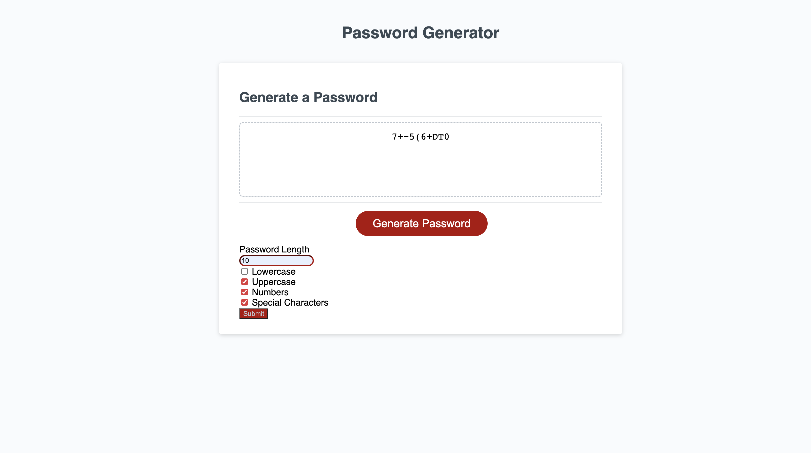
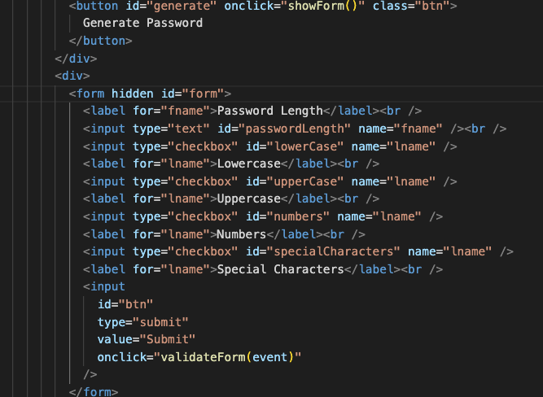
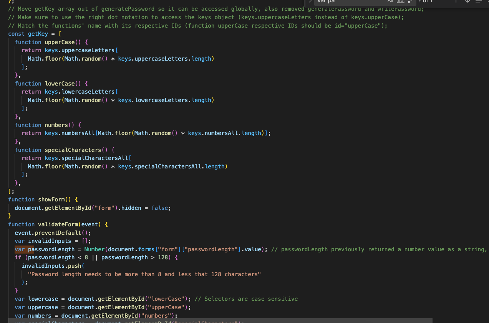
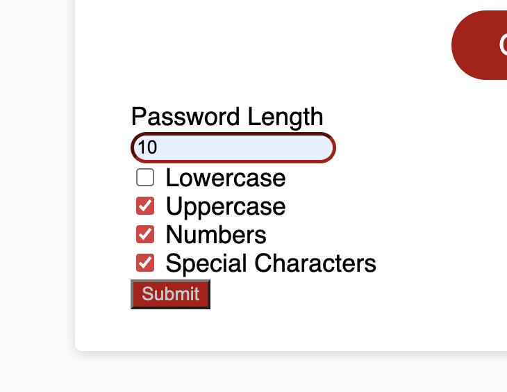

# PasswordGenerator

## Description

The purpose of this project was to display the power of Java Script. Java Script is what makes this password generator work. Depending on what criteria you choose, it will make a password that suits your needs. 

## Table of Contents

- [PasswordGenerator](#passwordgenerator)
  - [Description](#description)
  - [Table of Contents](#table-of-contents)
  - [Installation](#installation)
  - [Usage](#usage)
  - [Credits](#credits)
  - [License](#license)

## Installation

N/A

## Usage

Now you can go on the hosted page and follow the prompts to get a sophisticated password. you can go the website with this URL. 

## Credits

N/A

## License

Please refer to the LICENSE in the repo.
